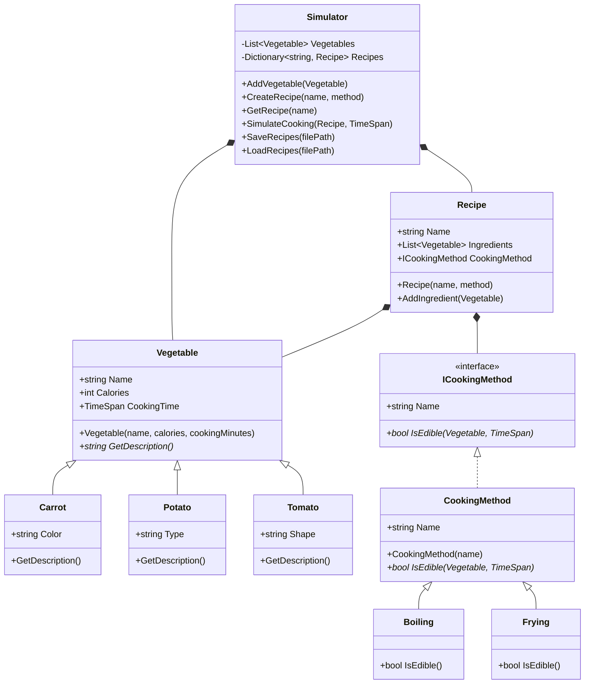

# Vegetable Cooking Simulator Architecture Design

## Overview

This document outlines the architecture for a C# console application that simulates cooking vegetables. The app demonstrates key C# principles including OOP, interfaces, collections, file I/O, exception handling, and generics.

## Key Classes and Relationships

### Vegetable (Base Class)

- **Purpose**: Abstract base class for all vegetables.
- **Properties**:
  - `string Name`: Name of the vegetable.
  - `int Calories`: Caloric content.
  - `TimeSpan CookingTime`: Required cooking time.
- **Methods**:
  - `protected Vegetable(string name, int calories, int cookingMinutes)`: Constructor.
  - `abstract string GetDescription()`: Returns a description, overridden by subclasses.
- **Encapsulation**: Properties use auto-implemented getters/setters; constructor validates inputs.

### Specific Vegetable Classes

Inherit from Vegetable, demonstrating polymorphism.

- **Carrot**: Color = "Orange", CookingTime = 10 min, Calories = 25.
- **Potato**: Type = "Starchy", CookingTime = 20 min, Calories = 77.
- **Tomato**: Shape = "Round", CookingTime = 5 min, Calories = 18.

Each overrides `GetDescription()` to include unique properties.

### ICookingMethod Interface

- **Purpose**: Defines cooking method contract.
- **Members**:
  - `string Name`: Name of the method.
  - `bool IsEdible(Vegetable vegetable, TimeSpan actualCookingTime)`: Determines if cooking result is edible.

### CookingMethod (Abstract Class)

Implements ICookingMethod, provides base for concrete methods.

- **Boiling**: Edible if actual time >= 50% and <= 150% of vegetable's cooking time.
- **Frying**: Edible if actual time >= 75% and <= 125% of vegetable's cooking time.

### Recipe Class

- **Purpose**: Represents a cooking recipe.
- **Properties**:
  - `string Name`
  - `List<Vegetable> Ingredients`
  - `ICookingMethod CookingMethod`
- **Methods**:
  - `void AddIngredient(Vegetable v)`: Adds vegetable to ingredients.

### Simulator Class

- **Purpose**: Core class managing app logic.
- **Properties**:
  - `List<Vegetable> Vegetables`: Inventory (demonstrates generics and collections).
  - `Dictionary<string, Recipe> Recipes`: Recipe collection (key by name).
- **Methods**:
  - `void AddVegetable(Vegetable v)`
  - `void CreateRecipe(string name, ICookingMethod method)`
  - `Recipe GetRecipe(string name)`
  - `bool SimulateCooking(Recipe r, TimeSpan time)`: Simulates and checks edibility.
  - `void SaveRecipes(string filePath)`: Serializes to JSON.
  - `void LoadRecipes(string filePath)`: Deserializes from JSON.

## Data Structures

- `List<Vegetable>`: For vegetable inventory.
- `Dictionary<string, Recipe>`: For recipes, allowing fast lookup by name.
- Generics used throughout for type safety.

## File I/O

- **Format**: JSON for recipes using System.Text.Json.
- **Example JSON**:

```json
{
  "Recipe1": {
    "Name": "Recipe1",
    "Ingredients": [{ "Name": "Carrot", "Calories": 25, "CookingTime": "00:10:00" }],
    "CookingMethod": { "Name": "Boiling" }
  }
}
```

- **Methods**: In Simulator, SaveRecipes and LoadRecipes handle serialization/deserialization.

## Exception Handling

- **Custom Exceptions**:
  - `InvalidCookingTimeException`: Thrown if cooking time is negative.
  - `RecipeNotFoundException`: Thrown if recipe name not in dictionary.
- Try-catch blocks in input parsing and file operations.

## Class Diagram



## User Flow

1. **Main Menu**: Options: 1. Add Vegetable, 2. Create Recipe, 3. Simulate Cooking, 4. Save Recipes, 5. Load Recipes, 6. Exit.
2. **Add Vegetable**: Prompt for type, create instance, add to Simulator.Vegetables.
3. **Create Recipe**: Prompt for name, select ingredients from list, choose cooking method, add to Simulator.Recipes.
4. **Simulate Cooking**: Select recipe, enter cooking time, simulate, display result (edible/not).
5. **Save/Load**: Prompt for file path, call respective method.
6. Loop until exit.

This design ensures modularity, extensibility, and adherence to C# best practices.
